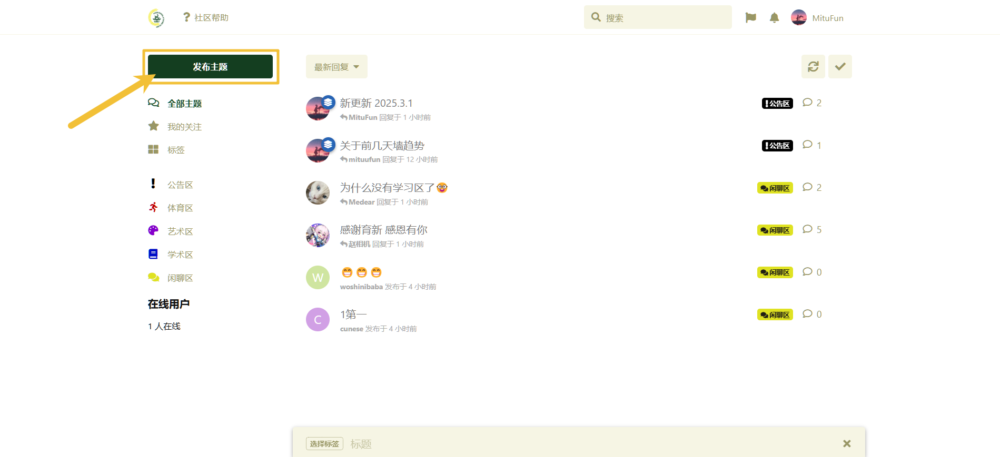
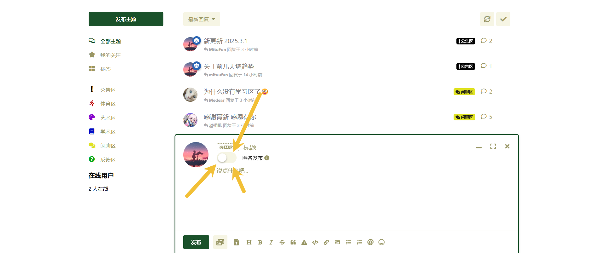
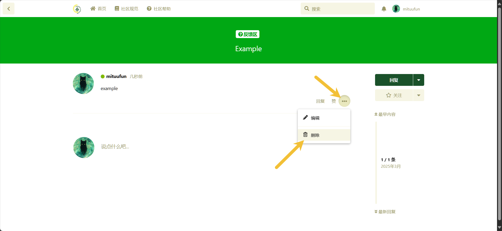
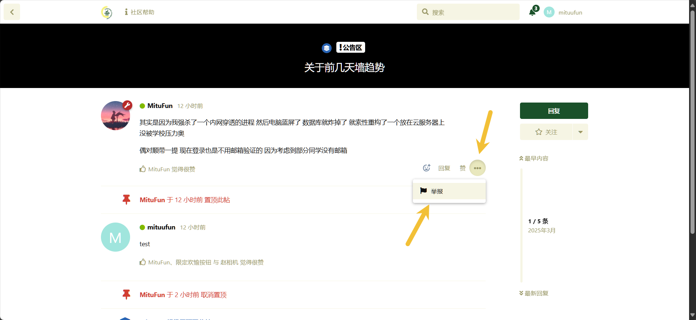
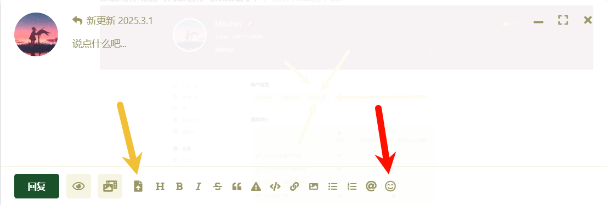
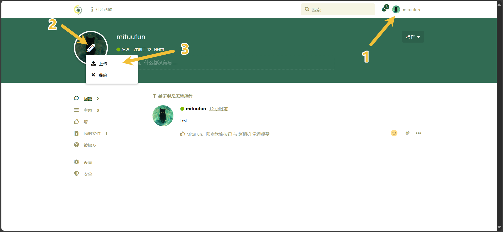
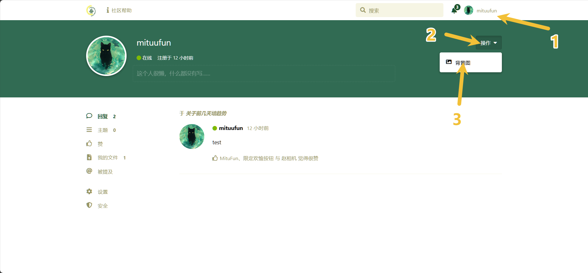

## 社区帮助

### 发帖

PC 端点击左侧“发布主题”，填写你要发的内容后选择标签即可。

手机端点击右上角的笔，填写你要发的内容后选择标签即可。

### 匿名发帖

发帖前点击匿名发布即可，如下图所示：

开了匿名也要注意点言辞奥

### 删帖

如下图所示进行操作：

回到主页你会发现你的帖子旁边头像上有个小垃圾桶，代表已经删除成功（如下图所示）。之所以还在展示，是因为社区具有回收站机制，你可以在一段时间内反悔并恢复帖子。无须担心，没人会再看见你的帖子的。

### 善用举报功能

如果有让你感到不适，或者违反社区规则的内容出现，你可以进行举报。具体方法如下：

同时，如果管理认为确实存在违规，将会对内容进行删除。如果此用户在最近时间内多次违反社区规范，严重者进行封禁处理。

### 上传图片和发送表情

上传图片（黄色箭头）发送表情（红色箭头）

  

### 修改头像

按照图中标号顺序进行操作即可

### 修改主页背景图

按照图中标号顺序进行操作即可

（我测试的时候发现某些图片上传后会报错，但是始终没有找出是因为什么。但是换一张图就好了，玄学得很。。。）

### 经验系统

#### 增加经验

- 发表帖子随机增加 10~40 经验
- 发表回复随机增加 5~30 经验
- 受到点赞随机增加 5~15 经验

#### 经验等级

| 等级名称 | 所需经验值 |
| :------- | :--------- |
| 0        | 0          |
| 1        | 50         |
| 2        | 100        |
| 3        | 150        |
| 4        | 200        |
| 5        | 250        |
| 6        | 300        |
| 7        | 350        |
| 8        | 400        |
| 9        | 450        |
| 10       | 500        |
| 11       | 550        |
| 12       | 600        |
| 13       | 650        |
| 14       | 700        |
| 15       | 750        |
| 16       | 800        |
| 17       | 850        |
| 18       | 900        |
| 19       | 950        |
| 20       | 1000       |
| 21       | 1050       |
| 22       | 1100       |
| 23       | 1150       |
| 24       | 1200       |
| 25       | 1250       |
| 26       | 1300       |
| 27       | 1350       |
| 28       | 1400       |
| 29       | 1450       |
| 30       | 1500       |
| 31       | 1600       |
| 32       | 1700       |
| 33       | 1800       |
| 34       | 1900       |
| 35       | 2000       |
| 36       | 2100       |
| 37       | 2200       |
| 38       | 2300       |
| 39       | 2400       |
| 40       | 2500       |
| 41       | 2650       |
| 42       | 2800       |
| 43       | 2950       |
| 44       | 3100       |
| 45       | 3250       |
| 46       | 3400       |
| 47       | 3550       |
| 48       | 3700       |
| 49       | 3850       |
| 50       | 4000       |
| 51       | 4200       |
| 52       | 4400       |
| 53       | 4800       |
| 54       | 5000       |
| 55       | 5500       |
| 56       | 6500       |
| 57       | 8000       |
| 58       | 10000      |
| 59       | 15000      |
| 60       | 20000      |

