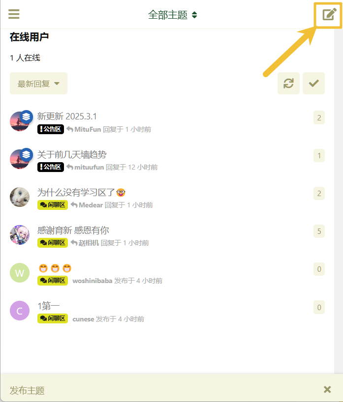

## 社区帮助

### 发帖

PC 端点击左侧“发布主题”，填写你要发的内容后选择标签即可。

手机端点击右上角的笔，填写你要发的内容后选择标签即可。

### 匿名发帖

发帖前点击匿名发布即可，如下图所示：

注意，匿名并不意味着你可以为所欲为，管理始终可以看到发帖者，并可追究违规责任。

### 善用举报功能

如果有让你感到不适，或者违反社区规则的内容出现，你可以进行举报。具体方法如下：

同时，如果管理认为确实存在违规，将会对内容进行删除。如果此用户在最近时间内多次违反社区规范，严重者进行封禁处理。

### 上传图片和发送表情

上传图片（黄色箭头）发送表情（红色箭头）

  

### 修改头像

按照图中标号顺序进行操作即可

### 修改主页背景图

按照图中标号顺序进行操作即可

（我测试的时候发现某些图片上传后会报错，但是始终没有找出是因为什么。但是换一张图就好了，玄学得很。。。）

