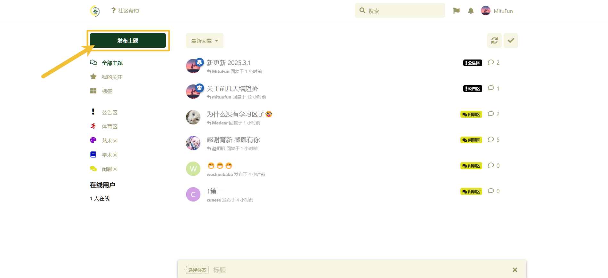
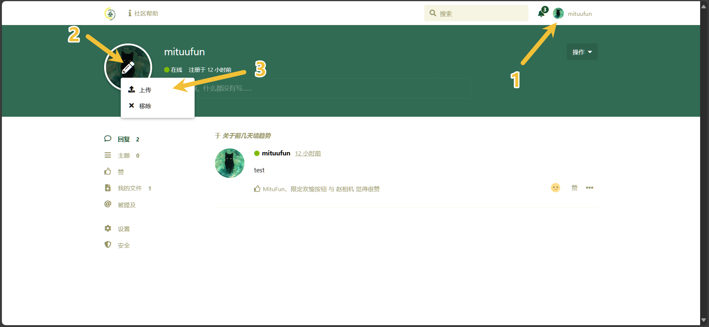

# 社区规范和帮助

**你可以通过右侧的导航快速找到内容。**

## 社区规范

### 总则

欢迎大家加入**韭菜鸡蛋墙**（下简称墙）！为了维护良好的交流环境，确保所有同学都能愉快、安全地使用墙，特制定以下规范。所有同学在使用墙时，必须遵守本规范及相关法律法规。

### 言论规范

1. **遵守法律法规**：不得发布违反国家法律法规的信息，包括但不限于政治敏感内容、非法交易、暴力恐怖、涉黄涉毒等内容。
2. **尊重他人**：不得发布侮辱、诽谤、骚扰、歧视、挑衅、恶意攻击他人的内容。
3. **禁止网络暴力**：不得煽动、参与或助长针对任何个人或群体的网络暴力。
4. **杜绝造谣与虚假信息**：不得发布未经证实的消息，恶意散播谣言，或误导他人。
5. **文明用语**：不得使用低俗、辱骂、猥亵、恐吓性语言。
6. **禁止恶意刷屏**：不得通过重复发帖、无意义内容等方式干扰社区正常交流。

### 内容发布规范

1. **主题明确**：发帖须符合社区主题，禁止无关或恶意广告。
2. **尊重版权**：禁止发布侵犯他人知识产权的内容，如未经授权的文章、图片、音视频等。
3. **真实可靠**：发布商品、服务等交易信息时，请确保真实，不得虚假宣传或诈骗。
4. **禁止恶意引战**：不得发表煽动性言论，制造对立、破坏社区和谐。

### 交易与责任

1. **交易自愿原则**：社区内的所有交易均为用户之间的自愿行为，社区仅作为信息发布平台。
2. **谨慎辨别信息**：用户在购买或出售商品、服务时，应自行判断其真实性和可靠性。
3. **风险自负**：因交易产生的任何纠纷、损失，由交易双方自行承担，社区不负任何责任。

### 管理与处罚

1. **违规处理**：对于违反本规范的行为，管理员有权删除违规内容、限制发言、封禁账号等。
2. **严重违规处罚**：对于严重违反本规范、影响社区秩序或对他人造成严重伤害的用户，管理员有权**封禁账号**，并在必要情况下向学校相关部门**反映情况**。
3. **举报机制**：鼓励用户举报违规内容，经核实后将采取相应措施。
4. **最终解释权**：墙有权根据实际情况对本规范进行修订，并保留最终解释权。

### 免责声明

1. 本社区仅提供交流平台，所有用户言论仅代表个人观点，不代表本社区的立场。
2. 任何因使用本社区而产生的直接或间接损失，本社区不承担任何责任。
3. 若用户违反本规范导致法律后果，责任由用户本人承担。

感谢大家共同维护一个友善、理性、积极的网络环境！

## 社区帮助

### 发帖

PC 端点击左侧“发布主题”，填写你要发的内容后选择标签即可。

手机端点击右上角的笔，填写你要发的内容后选择标签即可。

### 善用举报功能

如果有让你感到不适，或者违反社区规则的内容出现，你可以进行举报。具体方法如下：

同时，如果管理认为确实存在违规，将会对内容进行删除。如果此用户在最近时间内多次违反社区规范，严重者进行封禁处理。

### 上传图片和发送表情

上传图片（黄色箭头）发送表情（红色箭头）

  

### 修改头像

按照图中标号顺序进行操作即可

### 修改主页背景图

按照图中标号顺序进行操作即可

（我测试的时候发现某些图片上传后会报错，但是始终没有找出是因为什么。但是换一张图就好了，玄学得很。。。）

